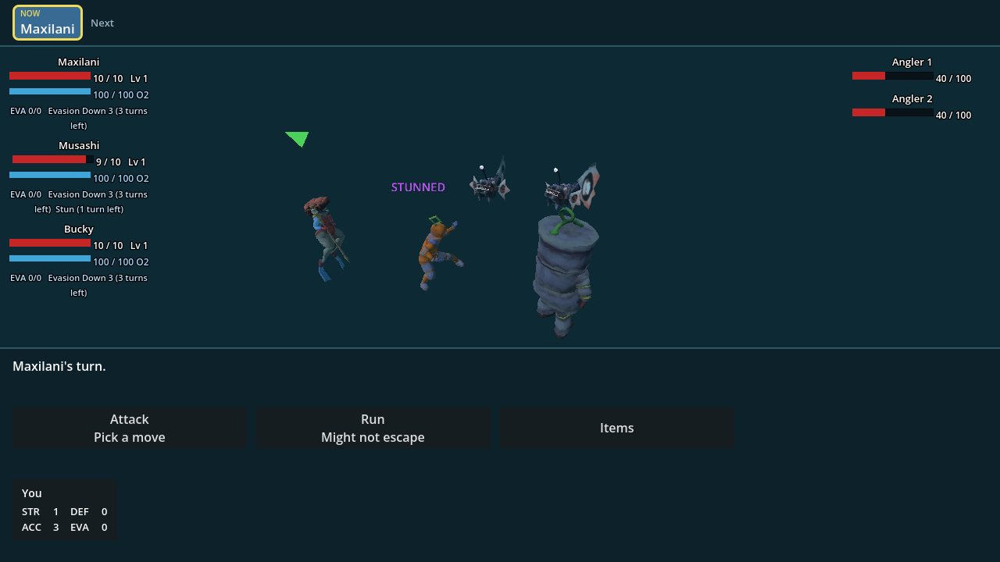

# PR100 focused stun and Angler AI repair

Source base: `05614547ee2835cee0f5c936a9c926c6ba444c79` (`integration/maze-campaign`).
This evidence accompanies the focused repair commit, not the older hosted export.
Surrounding combat gates were run on the prior `623d661` head; the intervening
maze-only commit does not change their combat inputs. Focused runtime and route
balance were rerun after carrying that commit forward intact.

## Runtime witness



Musashi dealt more actual damage than Maxilani. Angler Headbutted Musashi,
then his scheduled turn was skipped: `STUNNED`, one remaining Stun turn and
usable Maxilani controls are visible together. This is a controlled test scene:
both opponents were given 100 HP to survive multiple history observations.
Those HP values do **not** ship to ordinary encounters. Native Godot 4.7.1,
1280×720, production timing. Screenshot visually inspected before publication.

## Reproduce

```sh
godot --headless --path . --editor --quit
godot --headless --path . --script verify/authored_combat_turns.gd
godot --headless --path . --script verify/balance.gd
godot --path . --resolution 1280x720 --script verify/authored_combat_turns.gd -- --capture-authored-turns
```

## Observed results

- Original dispatcher: regression failed (wrong actor, missing countdown, EVA refill).
- Missing AI contract: independent RED failure.
- Removing live damage-recording calls temporarily: live regression failed while
  actor-level properties passed. Mutation removed before final verification.
- Final runtime regression: both sides skip 1–3 turns; forced tutorial initiative
  shares that boundary; 128 AI seeds produced 50 Headbutt witnesses; actual single
  and all-target buttons fed both enemies' history; actual missed Bite triggered
  party-wide Flash; actual Headbutt landed on the largest contributor and skipped
  his next turn; forced targets, fresh fights and other species stayed correct.
- Balance simulator uses the production joint decision/history, not a copied AI.
  Isolated wins: casual 99.2%, skilled 100% (120 seeds/policy).
  Two-artifact route: casual 90.4%, skilled 100% (240 seeds/policy).
  Existing bands unchanged. These are modeled policies, not human success rates.
- Passing surrounding gates: `glassgoat_combat`, `enemy_moves`, `swordfish_moves`,
  `combat_quick_read`, `combat_content_reconciliation`, `combat_initially_downed`,
  `marc_status_contract`, `combat_effect_feedback`, `combat_feedback`, `tutorial_qte`,
  `tutorial_continue_button`, `prologue_angler`, `prologue_combat`, `menus_spell_title`.
  Captured outputs contained no Godot script errors.

## Limits

This is not full PR100 merge approval. No new gameplay numbers, tutorial prose,
maze geometry, retry/menu fixes or canonical-main deployment changes were made.
The existing web playtest export is not refreshed by this source-only patch.
