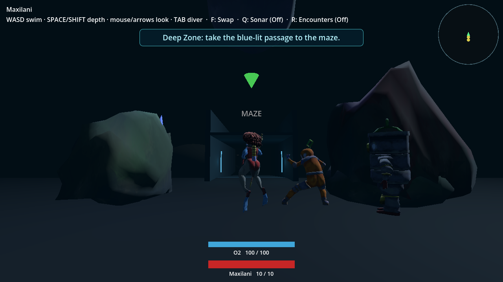
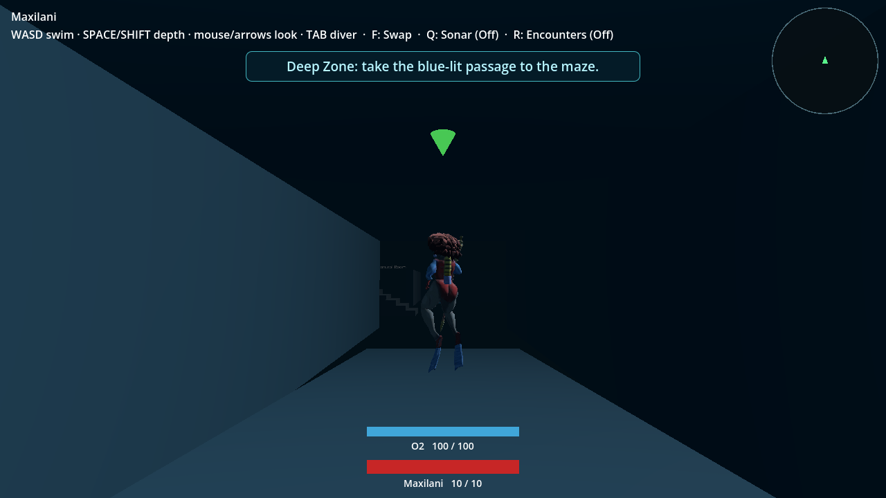
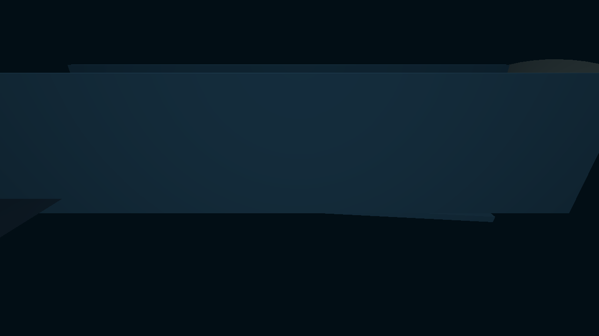

# Lab-side maze ramp and shared-world ownership — October 5

This is a focused PR #100 implementation batch, not full campaign acceptance.
It follows Mhanna's request to put the ramp beyond the laboratory rather than
immediately beyond the shallow blockade. Laboratory victory is not required.
No main push, merge, canonical-main deployment or new PR is part of this batch.

## Source and behavior

Parent source: `6d46c58ec6405803ea2db047b72e88f62890a232`.
The commit containing this packet changes World/Maze ownership and physical
entry. The maze shares the existing three actor nodes, resources, inventory,
campaign state and encounter preference. Swimming into/out of its bounds changes
the active camera/input/HUD owner without changing scenes or writing a save.
The normal route no longer includes the old shallow-exit or Wall27 scene portal.
Standalone review and old maze checkpoint compatibility remain supported.

## Reproductions and accepting checks

Environment: macOS, Godot 4.7.1. Headless checks use actual production scenes,
physics, key events and checkpoint IO; native images use Compatibility on
Apple M1 / OpenGL 4.1 Metal. Run scripts from the project root with:

`godot --headless --path . --script verify/<name>.gd`

| Receipt | What it establishes |
|---|---|
| `construction-red.log` | Original World has no embedded maze |
| `double-step-red.log` | Crossing applied two movement steps in one frame |
| `milestone-red.log` | Inactive maze construction advanced the opening boss milestone |
| `ownership.log` | Shared nodes, unchanged cold spawn, camera/HUD, both-way ramp and sink-held floor seam, single entry step, Tab/R and inactive parked Sonar |
| `checkpoint.log` | 48 JSON conservation cases, 24 legacy-frame cases and actual fresh-World Title Load |
| `spawn-route.log` | Real spawn-to-maze swimming/collision with both lab guards undefeated |
| `checkpoint-loss-970405.log`, `checkpoint-loss-970406.log`, `checkpoint-loss-970407.log` | Real checkpoint contact/save, rejected write, cold Load, real Cordys damage/loss and Restart with saved puzzle state |
| `world-return.log` | 12 selected/downed/lab-state World save/re-entry conservation cases |
| `party-handoff.log` | Six entrance party/kit/resource cases |
| `checkpoint-io.log`, `coordinate-frame.log` | Existing malformed IO and frame/reward replacement checks remain clean |
| `puzzle-deep-exit.log`, `area-entry.log` | Solved shallow doors lead to Deep water, no obsolete portal; normal lab-side area entry |
| `orb-reel.log`, `controls.log`, `earned-map.log` | Earlier focused reel/control/standalone earned-map behavior remains clean |

The loss runs additionally pass `-- --loss-seed=<seed>` and use one-HP Bucky
with the other two already downed, never an injected battle outcome or altered
boss stats. The test requires the actual `maze_cordys` encounter source.
The previous all-alive fixture sometimes won an unrelated fight; its cause is
not established, so it is not presented as a repaired encounter-priority bug.

## Native images — disclosed fixture, not a campaign playtest

Generated by `tools/shoot_lab_maze_ramp.gd`. It places the party at the real
production approach, with a completed-laboratory state to show the destination
goal. It does not earn that victory, acquire the map, prove balance or capture
the browser. The final physical headless checks separately retain locked-lab
access. No user save slots are used by the capture.

## Remaining acceptance

The full completion ledger remains authoritative. Latest underpass/drafts,
hazards/riders, discovery-only map/browser layout, Sonar/radius/notification
changes, scaling/recovery balance, the opening Tethys pivot, Cordys finale and
durable completion, Mermaid variant, full suite, ordinary earned-resource
campaigns, browser save behavior, fresh exports/served hashes and final PR
handoff are not accepted by this packet. The existing preview is stale until
its rebuilt source and served bytes are verified. These images must not be
represented as screenshots from that hosted preview.
