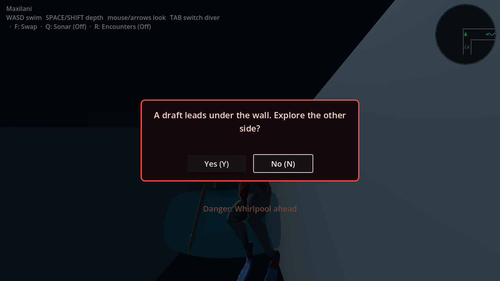
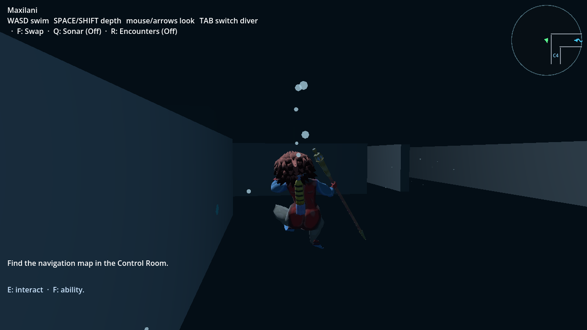
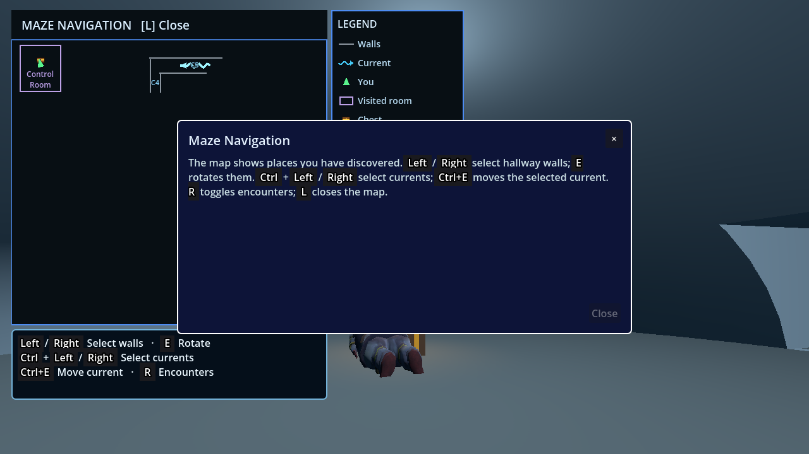
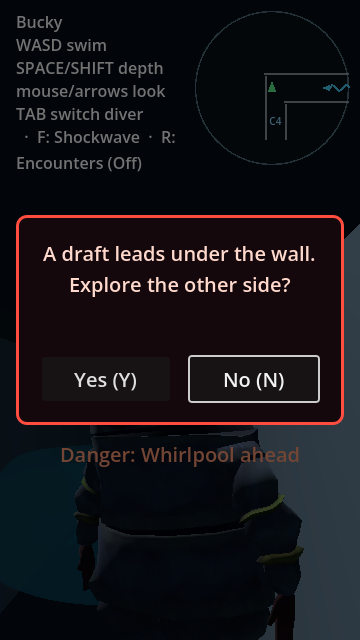
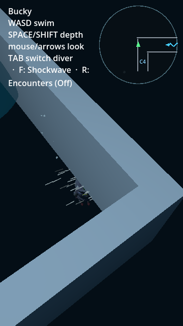

# Box12 / Control Room route replacement — October 5

Baseline PR100 `0d147b9`; authored late intake #97 `bba8b80`. This directory
belongs to the commit admitting **only the Box12/retired-route portion** of that
intake. C5 riders/collision, poster-west barrier, hall whirlpools, autosaves and
the remaining comprehensive campaign objective are still open. No deployment,
full-suite, normal campaign or merge-ready claim is made here.

## Production behavior

- A hallway-side, low approach to Box12 offers the existing draft Yes/No
  question. No latches the visit; swimming away/reapproaching rearms it.
  Outside/high approaches cannot reverse it.
- Yes uses the existing capsule-clear, bounded temporary floor tunnel. All
  three shared actors retain their HP/Oxygen, including empty tanks, and can
  swim after release. Blocked exits do not start motion; owner teardown returns
  the actor to its clear departure and seals the floor.
- The same overhead camera used for wall cutscenes frames draft motion instead
  of collapsing the ordinary chase camera into a below-floor diver.
- PathButton, rotating12/13 route and raised PathWalls are removed. Box8's line
  is fenced to the dome rim; the earned chest remains physically accessible.
- Old `_path_opened` history remains compatible but inert. Raw old PathWalls
  are accepted at the durable boundary without reconstructing them. Static
  home12/13 geometry is restored, and only overlapping saved capsules are
  moved to nearby validated water **outside active suction/pull radii**.
  Party resources, keys, inventory and earned map remain intact.

## Accepted evidence

Godot 4.7.1, macOS Apple M1; native renderer Metal/Forward+. Terminal exits were
zero and receipts were rejected if they contained `SCRIPT ERROR`, `ERROR:` or
`FINDING`. Source hashes: `source.sha256`. Images inspected after camera repair.

| Receipt | Contract actually exercised |
|---|---|
| `headless-route.log`, `native-route.log` | Actual swimming/No/reapproach/Yes for three capsules; six wrong-side/high negatives; actual paused lessons; transient key/save exclusion; zero-O2 conservation; 240 independently queried motion frames and real post-exit swimming; Bucky swims to chest and earns map using E/L. |
| `native-cold-legacy.log`, `headless-route.log` | 36 actor × coordinate frame × map ownership × captured/overlapping/unaffected placement cases; unmodified input JSON; retired route absent; valid reserialization; raw historical PathWall save written to guarded disposable slot918367, cold Title Load, correct slot/party/map/resources and real swimming. |
| `blocked-0.log` through `blocked-2.log` | Independent solid CSG exit rejects Yes without starting motion or opening the floor. |
| `teardown-0.log` through `teardown-2.log`, `native-narrow.log` | Actual traversal followed by transient owner removal; shared actor restored/unlocked at departure; floor sealed. True360×640 prompt and overhead motion captures. |
| `legacy-capture.log`, `verify/fixtures/maze_control_route_0d147b9.json` | Generated **before** production edits, using old actual E button and completed wall motion, not simulated new-code legacy data. |
| `red-missing-route.log` | Baseline actual hallway approach offered no Box12 prompt. |
| `red-migration-whirlpool.log` | Initial migration's geometrically clear nearby placement was caught by C4 and clipped the home wall; active-hazard exclusion repairs this real composition failure. |

Preservation reruns (not the full suite): pre-map earned chest from real shared
ramp entry and return; original Break Room outgoing/12 automatic return cases;
six draft restores and raw legacy cold return; 144 coordinate/frame cases;
48 embedded checkpoint cases/cold legacy Title Load; map discovery; six chest
ownership cases; first-person aim/anchor/reel/teardown; twelve special-site
layouts, 252 actual capsule approaches and three cold restores.

Reproduce using `verify/maze_box12_route.gd`; flags `--blocked`, `--cancel
--diver=0/1/2`, `--migration-only`, and native `--narrow --capture-dir=<directory>`.
Commands are also registered in the ordinary gate script. Do not run two
save-writing Box12 test processes concurrently: they share disposable918367.

## Observer corrections and limits

The initial legacy capture called a nonexistent map process method and printed
clean despite a script error; it was rejected and rerun before production edits.
The first reapproach observer crossed the separate C4 hazard and waited for a
waypoint after an automatic modal; use safe wall-side swimming and stop on the
actual prompt. Bucky's tall capsule needs real precise SPACE/Shift taps to fit
between raised-plinth floor and porch ceiling; neither collision nor whirlpool
was disabled to pass. The first narrow setup reapplied the project default:
resize the live window and assert requested rendered dimensions instead.
See the bug catalog for these disclosures; none is counted as a product repair.

Fixtures place actors near the feature and disable ordinary encounters via the
existing preference, not wall/current collision. They do not prove human
discoverability or a normal New Game journey. Native execution is not a browser
or Windows/Linux test. Public PR preview still serves `bffe1b5`; canonical main
is untouched. Final campaign/browser/build delivery remains required.

