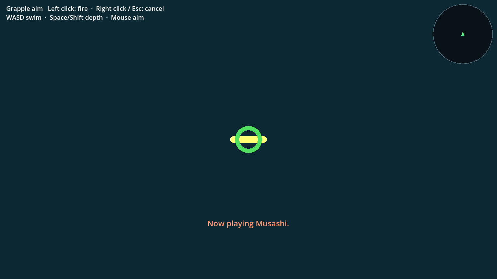
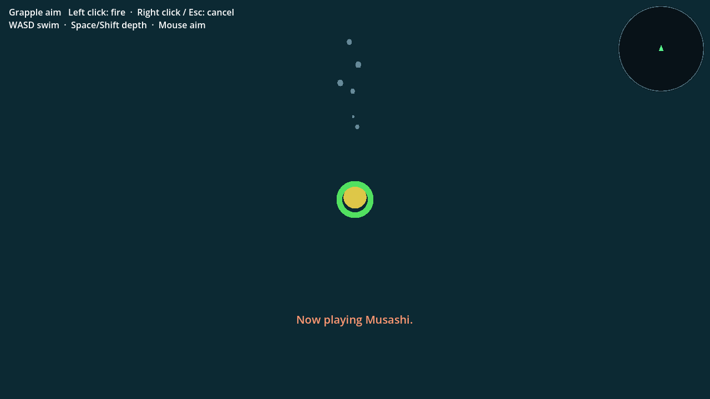
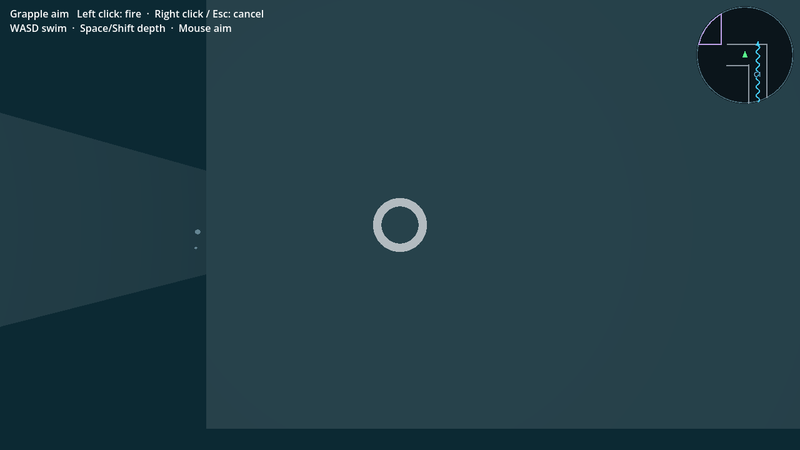

# Maze first-person grapple — October 5 bounded verification

This batch builds on pushed PR100 `440285a`. It ports authored #97
`c943218`/`4ec6598` aim/fire/cancel to the shared-party architecture. It is not
the complete campaign, whole-suite acceptance or a hosted-build update.

## Failures reproduced before accepting the repair

- `unported-F-red.log`: actual Tab/F immediately fires and spends cooldown
  instead of entering first-person aim (terminal 1 against 440285a).
- `reticle-orientation-red.log`: ported ring faces edge-on; independent local-Y
  normal versus camera-eye assertion fails (terminal 1). The printed AIM-4
  message is catalog AIM-6, separated from ray/target behavior.
- `physical-handoff-red.log`: after confirming correct shared Musashi ownership,
  actual aimed A-swimming stops at x=256.25. The stable-save guard also prevented
  relinquishing Maze ownership. Footer reports two findings/terminal 1; its
  intermediate handoff label is not a pass. Repaired run reaches x=224.8353.

## Accepted final-source runs

All below completed with terminal 0. Full logs inspected for script errors,
findings, infinite tweens and cleanup warnings; none found.

| Receipt | Meaning and limits |
|---|---|
| `aim-headless.log`, `aim-native.log` | Real F without fire/resource/cooldown; eye camera, nine generated cancels (three Oxygen levels × three paths), cooldown, actual left-click anchor travel/item reel/wall miss, seven blocked ownership keys, actual contact P and subsequent map/save, JSON restore and surviving actor teardown. No player-file writes. |
| `embedded-final.log` | Actual lab-side ramp entry/return and sink-held floor traversal, shared actors/inventory, one camera/HUD/input/movement step, parked Sonar/inactive encounters, actual F then aimed swimming back to World. Opening milestones/nearby placement are fixtures, not ordinary New Game route. |
| `checkpoint-final.log` | 48 embedded save/restore states and cold legacy Title Load in a disposable slot; no player slot overwritten. |
| `controls-final.log` | 88 actual F/E/control/zero-Oxygen and ownership checks. |
| `sonar-preservation.log` | Four legacy flags × three actors plus actual Q/G/Tab/area/menu/resource contract. |
| `map-preservation.log` | 64 discovery subsets, 12 paused first-open sizes, new/legacy JSON lesson history and later media handoff. |
| `chests-final.log` | Both solid chests × all three actors; blocked actions, pause/resume, one reward and released transient save lock. |
| `queue-model-final.log` | 484 independent FIFO/coalescing scenarios. |
| `world-aim-preservation.log` | Existing World aim/cancel/fire and distance-aware reticle behavior preserved. |

Commands, from the PR100 worktree, use `/opt/homebrew/bin/godot` 4.7.1:

```sh
godot --headless --path . --script verify/maze_grapple_aim.gd
godot --path . --rendering-method gl_compatibility --script verify/maze_grapple_aim.gd -- --capture-dir=/private/tmp/pr100-maze-aim-final-native
godot --headless --path . --script verify/embedded_maze.gd
godot --headless --path . --script verify/embedded_maze_checkpoint.gd
godot --headless --path . --script verify/marc_exploration_controls.gd
godot --headless --path . --script verify/marc_sonar_vision.gd
godot --headless --path . --script verify/maze_map_discovery.gd -- --legend --layout --persistence --media-transition
godot --headless --path . --script verify/marc_chest_ownership.gd
godot --headless --path . --script verify/orange_message_model.gd
godot --headless --path . --script verify/world_grapple_aim.gd
```

Headless/native aim runs used 60-second process limits; embedded traversal
120 seconds and checkpoint/map/chests 90 seconds. No timeout was accepted.

## Inspected native visuals

Apple M1/macOS, OpenGL Compatibility, 1280×720. The green ring is a valid
target; gray indicates an obstructing surface/miss. Fire/cancel/swimming
instructions remain visible without advertising blocked F/Tab/R actions.





Anchor/item images use an isolated open-water fixture at x/z=3000; they are
collision/input evidence, not map-route evidence. The checkpoint image is at
the actual Maze save pad. Modal map ownership is pre-granted only in its
specific fixture; earned chest acquisition is proven separately.

Rejected observers: nonexistent Save-menu node name, initial untyped test
Vector3 inference, an early pre-owner-physics observation and a premature
native quit before render cleanup. They were corrected, not reported as product
repairs. Three valid reds above remain the product/port reconciliation failures.

The public review alias still serves `bffe1b5`. Browser aim, full earned-resource
campaign routes, balance, later intake, final exports and PR merge readiness
remain on the full-scope completion ledger. Main/canonical link unchanged.
