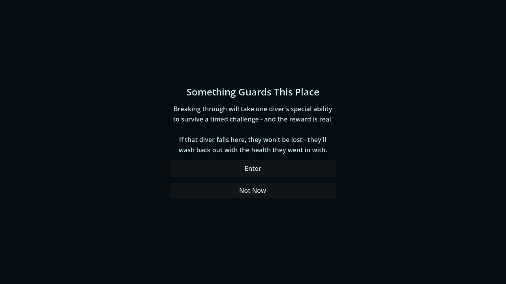
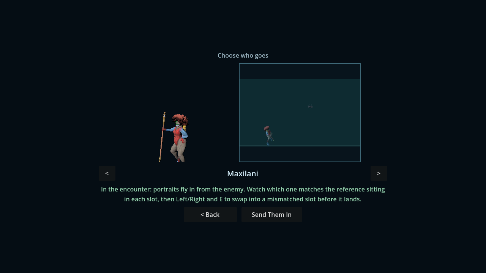
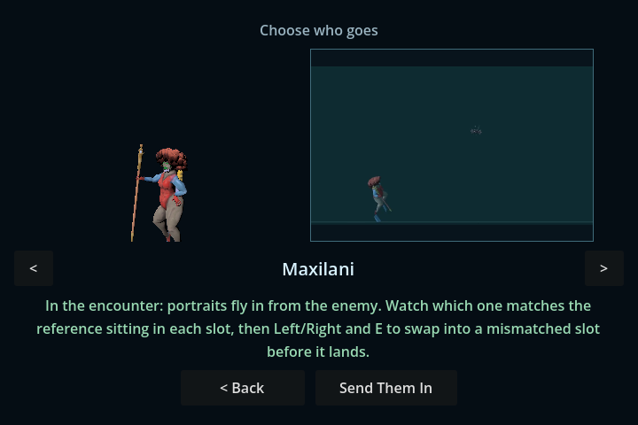
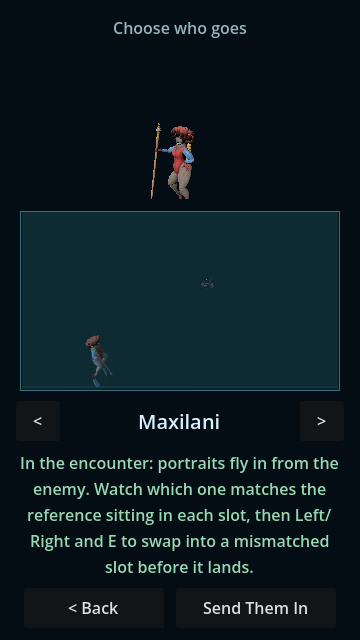

# Radius special-site admission — October 5

Source batch follows PR100 3d60e1d. Frozen upstream #97 4ec6598 contributes
seven invisible sites: one secret-item-room point, three between Break Rock and
Reward Chamber and three beyond the outgoing draft. Later bba8b80 geometry and
autosaves remain a separate pending intake. This is NOT full merge readiness.

## Player behavior

- Active Maxilani's Q discovers nearby sites; undiscovered sites do not appear
  in the discovery-only map/legend. Consumed sites leave live POIs.
- R enables radius entry. Wall occlusion, vertical separation, inactive area,
  paused lessons, maps, menus, chests, moving geometry, battles and Swap owners
  cannot open a competing chooser. Cancel asks only once per visit.
- Choose one of the three actual shared party actors. Downed selection does
  not grant revival or create a battle. Existing special minigames remain.
- Seven authored item/enemy pairs are preserved. Win consumes one site and
  awards once; loss/flee retains it. Maze-special wins fully restore the chosen
  actor, loss/flee restores entry HP/Oxygen, other party members remain unchanged.
  This authored exception is NOT an ordinary-victory recovery port.
- Randomized positions/revealed/consumed flags persist in optional checkpoint
  fields. Old saves remain readable; all positions rebase with the maze.
- Shared chooser now fits wide, short and narrow viewports; opaque background
  hides inactive HUD, keyboard Enter/Back/arrows work, hidden video stops.

## Accepted evidence

Godot 4.7.1, macOS/Apple M1; headless and native Metal. Terminal exit 0 and no
captured script/engine errors are required, not just a printed clean footer.

| Receipt | What it proves |
|---|---|
| sites-headless.log / sites-native.log | Actual Q/R and swimming, wall/height/inactive/modal owners; twelve actor/result cases; seven independent enemy/reward pairs with consumed re-entry; 384 full checkpoint JSON/rebase cases; ten malformed cases; legacy/live restore; paused UI bounds/keyboard/video cleanup. |
| sites-placement.log | Twelve fresh/cold layouts, all seven entries, 252 real capsule approaches, three cold restores, stable-save refusal before initialization and authored spacing. |
| preserve-special_encounters.log / preserve-special_minigame_dispatch.log / preserve-grapple_battle_integration.log | Existing World-special lifecycle/media and actual special dispatch/grapple minigame behavior retained. |
| preserve-maze_input_ownership.log | Three actors' actual map/save/Swap/strong-room preference owners retained. |
| preserve-embedded_maze.log / preserve-embedded_maze_checkpoint.log | Real bidirectional shared ramp/floor/aim handoff; 48 generated checkpoint cases plus 24 legacy origins and disposable-slot cold Title Load. |
| preserve-maze_coordinate_frame.log | 144 independent party/frame cases and invalid-frame/overflow boundaries retained. |
| preserve-maze_puppet_waves.log / preserve-puppet-final.log / preserve-maze_cordys.log | Existing authored waves and real seeded puppet/Cordys victories retain isolated rewards/music/state. Disclosed level-5 kits, NOT earned-route balance. |
| Other preserve-*.log | 88 controls, six chest owners, twelve legacy Sonar actors, map discovery, 484 notice cases and live notice/menu/save contact retained. |

Native captures inspected after the final render:

## Valid failures and rejected observers

- missing-red.log: actual Q on previous 3d60e1d reveals no authored site.
- layout-red.log: original chooser's fixed widths put action buttons outside
  720×480 and 360×640. Responsive layout repaired.
- paused-owner-red.log: corrected typed lesson probe catches chooser opening
  after the shared lesson pauses an in-flight frame. Explicit pause guard repairs it.
- rejected-untyped-observer.log printed clean after a typed-Array script error;
  never accepted as green. Native fixture also originally closed the lesson
  with R enabled, racing valid radius entry; disable fixture R before closing.
- Initial placement observer started part of the capsule outside the promised
  2.2m clearance. Correct whole-body approaches pass; no product placement fix
  claimed. Raw-array/float32 midpoint comparisons produced apparent JSON drift;
  semantic oracle now compares exact IDs/flags and serialized doubles within 1e-8.
- Seven-item matrix originally selected the actor left downed by the prior
  rejection test. Product correctly refused; matrix now chooses its living actor.
- Puppet preservation initially expected a retired scene-changing portal. Its
  repaired fixture physically swims the embedded ramp; concurrent cold restore
  now supplies saved positions before asynchronous placement instead of spawning
  a second random maze amid live World collisions. No geometry fix claimed.

## Limits

Public Battle finished signals in the site matrix verify lifecycle/resource
ownership only. They are NOT wins against actual minigames. Placement starts
near each site, not a normal navigated earned-resource route. Browser, normal
lab-first/maze-first journeys, late geometry/autosaves, combat economy, campaign
Tethys pivot/completion and full gates remain open. Preview alias still bffe1b5;
canonical main is untouched. Final matching web/Windows/Linux delivery pending.
