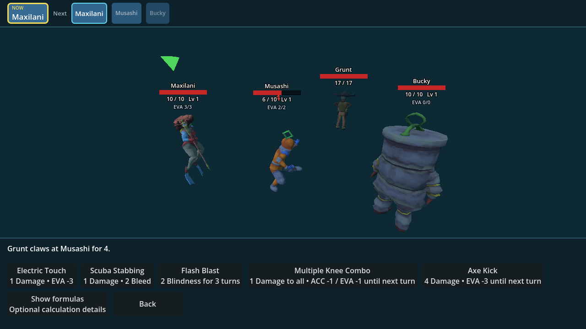
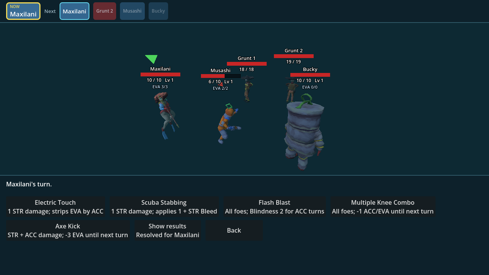
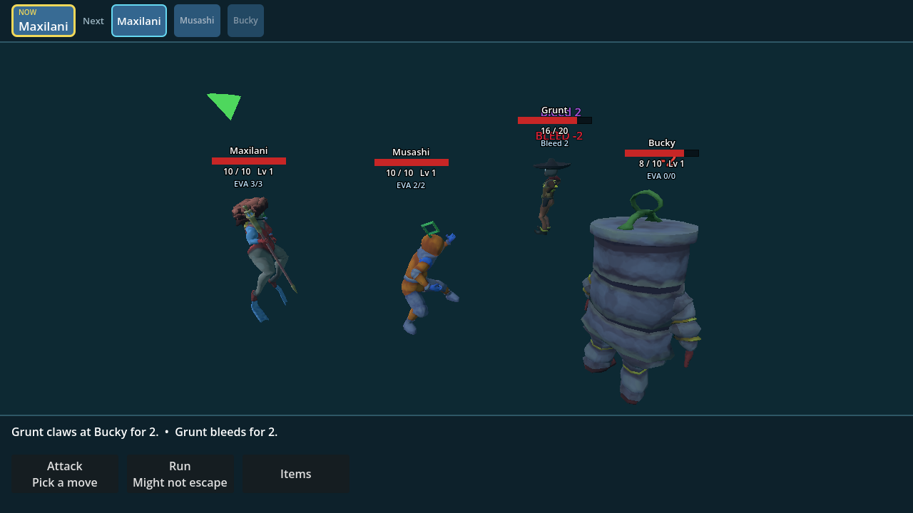

# Glassgoat combat V2 — implementation map

Source: Glassgoat's `Group_StatsV2.pdf`, delivered 24 August 2026.

This branch contains the first playable character kit and the later Discord
follow-up for the complete level-one roster baseline and result presentation.
It does not claim the full document's three move kits are finished.

## Implemented in this slice

- Scuba rig base stats: 10 HP, 1 Strength, 0 Defense, 3 Agility, 3 Evasion,
  3 Accuracy.
- Cyclops Diver base stats: 10 HP, 2 Strength, 2 Defense, 2 Agility, 2
  Evasion, 2 Accuracy.
- Bucky base stats: 10 HP, 4 Strength, 4 Defense, 1 Agility, 0 Evasion, 1
  Accuracy. `Bucky` is player-facing identity; the stable model/save ID remains
  `Prototype_V(1922)`.
- Deterministic Accuracy versus Evasion. Evasion wins a tie.
- Evasion as a spendable pool: a dodge subtracts the attacker's Accuracy and
  the pool refills at the defender's next turn.
- Skill formulas stored as data and evaluated against the wielder's stats.
- The V2 damage floor: a landed damaging attack deals at least 1 unless
  Defense exceeds raw damage by more than 5, in which case it is absorbed.
- Bleed stacks, gains a stack from later damaging attacks and deals its stack
  count at the bleeding character's turn end.
- Blindness lowers Agility, Accuracy and Defense by its level for a timed
  duration.
- Temporary move penalties clear at the user's next turn.
- All five Scuba moves and their authored animations:

| Move | Implemented rule |
| --- | --- |
| Electric Touch | Strength damage; lower target Evasion by wielder Accuracy |
| Scuba Stabbing | Strength damage; apply `1 + Strength` Bleed |
| Flash Blast | all foes; Blindness 2 for wielder Accuracy turns |
| Multiple Knee Combo | all foes; temporary -1 Accuracy and -1 Evasion |
| Axe Kick | `Strength + Accuracy` damage; temporary -3 Evasion |

- On-model damage, `DODGE`, `ABSORBED`, Bleed and applied-effect feedback.
- Party current/max Evasion and active statuses in the combat readout; enemy
  stats remain contextual rather than permanently displayed.
- Contextual HP, Defense, Evasion and Accuracy while choosing a target.
- Result-first move choices resolve the current actor's formula into values such
  as `1 Damage` and `2 Bleed`; an optional **Show formulas** control preserves
  the authored calculation details.
- Damage, beneficial/neutral feedback, and negative effects render separately
  in red, blue, and purple respectively.
- Campaign balance against the authored 10/10/10 roster, with fixed-seed route
  completion of 53.3% casual and 93.3% skilled in the no-consumable model.

## Deliberate interpretation

The PDF's Evasion paragraph explicitly says Evasion wins a tie, while the next
paragraph contains both “same or more accuracy ... will hit” and “losing on a
tie.” The implementation treats the latter as Accuracy losing the tie. This
also matches the deterministic comparison already on `main`.

## Not implemented by this slice

- Agility granting multiple actions.
- Electrical, Stun, obstruction, poison, Sound or biology-based resistance.
- Sightless, Echolocation/Sonar, Autotomy or Regeneration traits.
- Cyclops Diver and Bucky's V2 move kits. Their base stat blocks are implemented.
- Final human feel/balance acceptance. The automated route model is deliberately
  reproducible and conservative, but its 30%/80% QTE success assumptions are
  not measurements of human reaction time.

Those are subsequent vertical slices, not hidden claims of this pull request.

## Follow-up visual evidence

Default move choices show the acting character's resolved results and the
complete roster uses Glassgoat's supplied names and level-one HP baseline:

The optional control reveals the authored formulas without making every player
calculate them during ordinary move selection:

Damage and Bleed are distinct floating messages, allowing the requested red and
purple categories to remain legible when one attack produces both:

