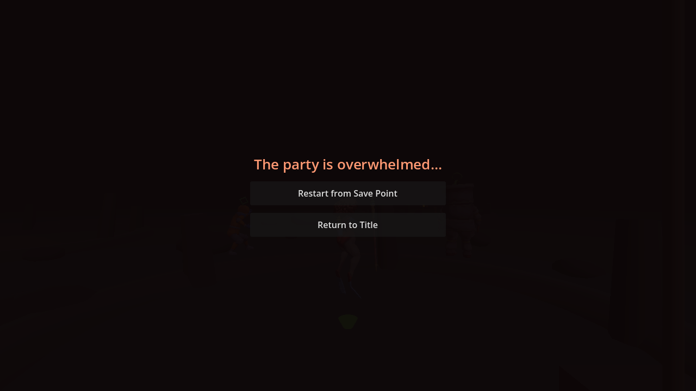
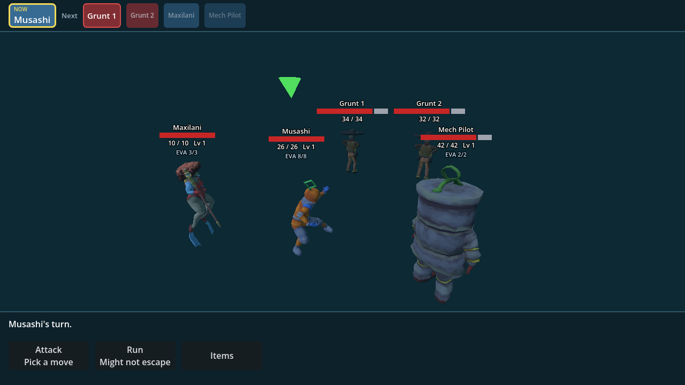

# PR 54 final merge-readiness audit

> Historical PR #54 snapshot. Glassgoat's September 2 follow-up superseded the
> provisional `Mech Pilot` label and mixed 10/26/42-HP roster. The follow-up
> branch uses **Bucky**, the complete authored 10/10/10-HP baseline, and reruns
> campaign balance; the older figures below explain PR #54, not current tuning.

This audit was triggered by a manual loss that left the world HUD, control
instructions, and encounter banner visible underneath the defeat buttons, and
by a player being unable to clear even one encounter.

## Player-visible corrections

- Defeat now owns the viewport on the same overlay layer as the title screen.
  The active-diver HUD, controls, bars, minimap, and banner are hidden as one
  unit while gameplay is paused.
- The defeat root resets both anchors and offsets, preventing its content from
  collapsing into the upper-left corner.
- Character identity remains centralized in `Cast` and used by both World and
  Battle: **Maxilani**, **Musashi**, and now **Bucky**.
- The internal model/save IDs are unchanged; only the third player-facing label
  was updated when Glassgoat supplied her name.

## Historical PR #54 combat campaign correction

The old balance headline reset a fresh party for every seed. It reported a
healthy aggregate while its own breakdown contained **0/38 casual wins against
three grunts**, and it never tested traversal to an artifact.

The replacement campaign model uses the actual 74 m linked route from anchor
to shallows to trench, production's 8–16 m / 50% random-encounter process, both
guaranteed guardian battles, persistent party resources, production XP and
level growth, living-party enemy scaling, and explicit QTE assumptions. It
uses no consumables and no unearned full heal.

Production tuning driven by the RED results:

- level 1 rolls one or two grunts; three-grunt packs unlock at level 2;
- one visible artifact guardian produces one combat enemy;
- victory restores 30% HP, oxygen, and barrier, clears battle statuses, and
  can revive a knocked-out diver; only a level-up remains a full refill.

Final fixed-seed results (240 complete routes per policy):

| Policy | Single legal encounter | Reach farthest artifact | Successful-run battles | Successful-run party HP |
|---|---:|---:|---:|---:|
| Casual (basic/random choices, 30% heavy-QTE dodge) | 93.3% | **50.4%** | 4.1 | 78.3 |
| Skilled (focus fire/best move, 80% heavy-QTE dodge) | 100.0% | **84.6%** | 4.6 | 81.1 |

The route gates were fixed before tuning: casual ≥50%, skilled ≥80%, and a
skill gap ≥10 percentage points. Final gap is 34.2 points. Successful runs
average 5.3–6.5 grunts, so success does not depend on avoiding combat.

These are transparent strategy models, not a claim that 30% and 80% are
measured human reaction-time distributions. Marc should still perform the
manual feel pass in the linked build.

With the later authored roster and follow-up ordinary-enemy tuning, the same
fixed-seed gate now reports 85.0%/98.3% isolated encounter wins and
53.3%/93.3% farthest-artifact completion for casual/skilled policies. Those
current values replace the historical headline above.

## Automated coverage

- `verify/pr54_merge_readiness.gd` enters defeat through the real `World`
  transition and checks full-viewport/exclusive UI, then checks all three names
  in both the live world HUD and Battle party entries.
- `verify/balance.gd` retains per-pack isolated results and adds persistent
  end-to-end route simulations.
- `verify/encounters.gd` now rejects a multi-enemy guardian or a three-grunt
  level-1 opening pack in a real Battle.
- `verify/gates.sh` runs these alongside the full animation, boss, combat,
  sites, title, fight, rendered framing, and browser suite.

## Visual evidence

